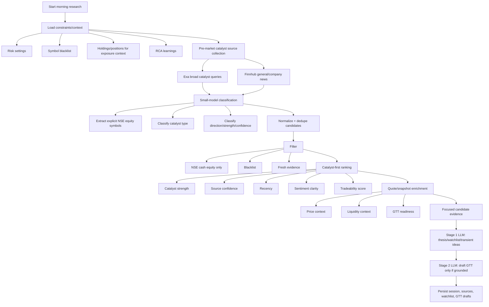

# Pre-Market Catalyst Research

## Summary

Morning research now uses a **pre-market catalyst-first** discovery flow. The goal is to estimate NSE cash equities that may move after market open, rather than using after-the-fact top gainers/losers as the primary research universe.

The pipeline no longer uses hardcoded default symbols such as `NIFTY 50`, `BANKNIFTY`, `RELIANCE`, `HDFCBANK`, or `INFY` as production seed symbols.

## Current flow



## Candidate discovery behavior

### Primary discovery

Primary discovery comes from pre-market catalyst sources, not from price movement tables. Broad queries are intentionally about likely movers and catalysts, for example:

- NSE stocks in news today India pre market
- Indian stocks likely to move today results order win approval
- stocks to watch today NSE earnings results
- NSE companies order wins approvals acquisitions today
- brokerage upgrade downgrade Indian stocks today
- Indian sectors in focus today global cues crude rupee rates

These are query templates, not symbol hardcoding.

### Small-model classification

The small model is used for lightweight structured classification before the main research call. It classifies each source into:

- explicit NSE cash-equity symbols/tickers mentioned by the source
- catalyst type
- catalyst direction
- catalyst strength
- confidence
- short rationale

Supported catalyst types:

```txt
earnings
order_win
mna
regulatory
corporate_action
brokerage_rating
sector_cue
global_cue
management_commentary
litigation_or_risk
other_news
```

Supported directions:

```txt
positive
negative
mixed
unknown
```

If the small-model classifier fails, the service falls back conservatively to provider-supplied symbols only with `other_news` and `unknown`; it does not infer a symbol from arbitrary text.

### Reactive NSE movers

`NseMarketMoverProvider` is no longer the primary pre-market discovery mechanism. It is only an explicit fallback/confirmation signal when `enableReactiveMoverConfirmation` is enabled. This prevents already-moved names from dominating pre-market research.

## Ranking model

Candidates are ranked by likely catalyst impact rather than raw price movement:

```txt
candidateScore =
  catalystStrength +
  sourceConfidence +
  recencyScore +
  sentimentClarity +
  tradeabilityScore +
  optional reactive confirmation bonus
```

Movement and volume are retained as optional confirmation/validation metadata, not as primary discovery inputs.

## Stage 1 vs Stage 2 grounding

Stage 1 may include catalyst-backed watchlist candidates that do not yet have price/liquidity context, but those must be treated as watchlist-only / needs validation.

Stage 2 may create GTT drafts only when the candidate has grounded price/risk context:

- last/reference price exists
- target price exists
- stop-loss price exists
- source/candidate evidence supports the thesis
- risk settings are respected

If price/risk context is missing, Stage 2 must return an empty `gttCandidates` array for that candidate.

## Discovery settings

`DEFAULT_DISCOVERY_SETTINGS` controls resource limits and freshness policy:

| Setting | Meaning |
| --- | --- |
| `candidateShortlistSize` | Number of catalyst candidates passed to the LLM. |
| `broadSourceLimit` | Max broad pre-market news/search sources collected before symbol extraction. |
| `focusedSourceLimit` | Max focused follow-up sources per shortlisted candidate. |
| `sourceLimit` | Max total deduped research sources persisted/supplied downstream. |
| `snapshotLimit` | Max recent quote snapshots inspected for price/liquidity enrichment. |
| `promptSourceLimit` | Max sources included directly in final prompt context. |
| `freshnessHours` | Freshness window for catalyst evidence and snapshots. |
| `newsLookbackDays` | Lookback window for news/search providers. |
| `minVolume` | Minimum volume for liquidity validation. |
| `enableReactiveMoverConfirmation` | Enables reactive NSE top-mover confirmation/fallback. Disabled by default. |

## Edge cases

- **No LLM API key:** morning research does not start.
- **No Exa/Finnhub keys:** catalyst source collection may return no external evidence; the run should surface warnings/empty discovery rather than invent symbols.
- **Small-model classifier fails:** source classification falls back to provider-supplied symbols only; no regex-based symbol inference from title/summary is used.
- **Small model returns an invalid ticker:** symbol is normalized and rejected unless it looks like an NSE cash-equity symbol and is not a common news token.
- **Source mentions a company name but no ticker:** candidate is not created unless a provider or classifier supplies an explicit tradingsymbol.
- **Fresh news has no price data:** candidate can appear in Stage 1 as watchlist-only / needs validation; it cannot become a GTT draft.
- **Price exists but liquidity is missing/low:** candidate may be price-validated but should not be treated as GTT-ready unless liquidity validation passes.
- **Blacklisted symbol appears in strong news:** candidate is filtered out before ranking.
- **Duplicate sources/providers mention the same symbol:** candidates are deduped by `exchange:tradingsymbol`, evidence is merged, and the stronger catalyst metadata is retained.
- **NSE top mover data is available pre-market/after-open:** it is not primary discovery unless reactive confirmation is explicitly enabled.
- **Provider returns stale article timestamps:** stale evidence is filtered using `freshnessHours`.
- **Broad sector/global cue has no explicit stock:** it can inform market thesis through sources, but should not create a candidate without an explicit symbol.
- **LLM proposes unsupported symbol:** server validation rejects watchlist/trade/GTT output not grounded in discovered candidates, broker context, or source symbols.
- **GTT output lacks reference price, target, or stop-loss context:** server validation rejects it or requires an empty GTT output.
- **Reactive confirmation contradicts catalyst direction:** it is treated as confirmation metadata only; the source catalyst evidence remains the primary thesis basis.
